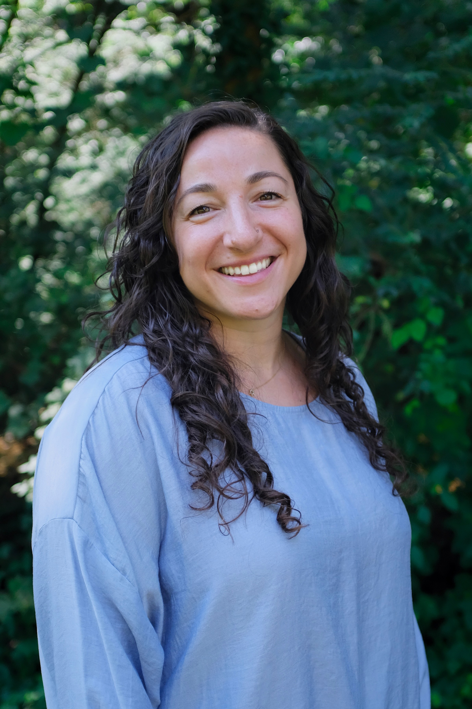

### Collaborative Biostatistician

I am a Research Associate in the [Center for Innovative Design and Analysis (CIDA)](https://coloradosph.cuanschutz.edu/research-and-practice/centers-programs/cida) at the Colorado School of Public Health. At CIDA, I manage the Consulting Center and collaborate with the Division of Gastroenterology and Hepatology in the Department of Medicine as well as the Department of Family Medicine at the University of Colorado's Anschutz Medical Campus. Previously, I was a postdoctoral research associate at the University of Virginia (UVA) in the Department of Public Health Sciences under the mentorship of Dr. Sarah Ratcliffe. I earned my PhD in biostatistics from Virginia Commonwealth University in 2019 under the mentorship of Dr. Roy Sabo and my BA in Spanish from UVA in 2014. In my free time, you can often find me cuddling with my dog, Bennett, skiing, or working on my many knitting projects. Thank you for taking the time to check out my work!
