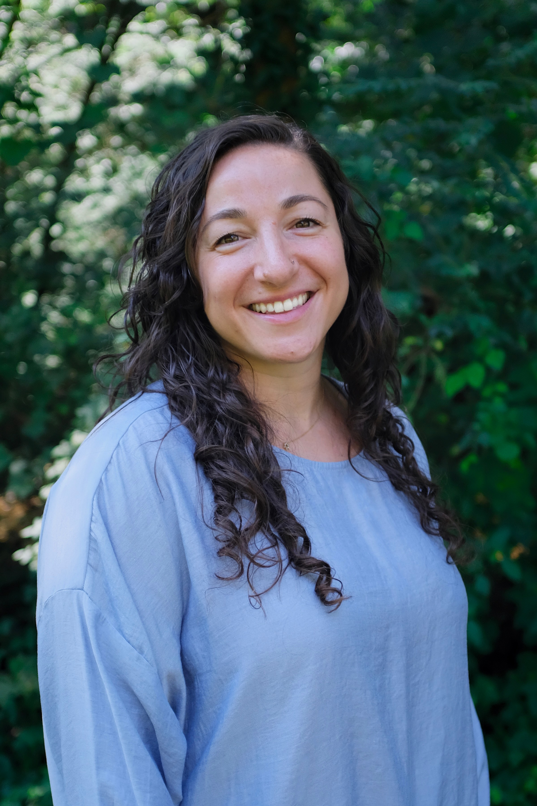

### Collaborative Biostatistician

I am an Assistant Professor in the [Center for Innovative Design and Analysis (CIDA)](https://coloradosph.cuanschutz.edu/research-and-practice/centers-programs/cida) in the Department of Biostatistics and Informatics at the Colorado School of Public Health (CSPH). My research interests include reproducibility and the science of team science. At CIDA, I collaborate with the Division of Gastroenterology and Hepatology in the Department of Medicine as well as the Department of Emergency Medicine. I also previously managed CIDA's Consulting Center for five years. Prior to CSPH, I was a postdoctoral research associate at the University of Virginia (UVA) in the Department of Public Health Sciences under the mentorship of Dr. Sarah Ratcliffe. I earned my PhD in biostatistics from Virginia Commonwealth University in 2019 under the mentorship of Dr. Roy Sabo and my BA in Spanish from UVA in 2014. When not at work, I enjoy spending time with my husband and daughters, exploring Colorado, cuddling with my dog, skiing, or working on my many knitting projects. Thank you for taking the time to check out my work!
